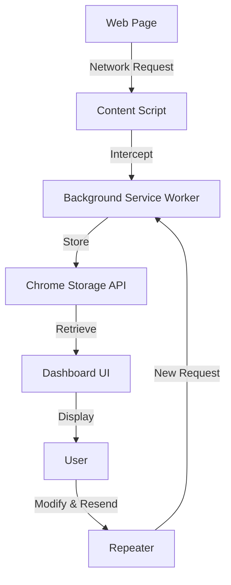

<div align="center">

# 🔍 API & JS File Analyzer Pro

### *Advanced Chrome Extension for HTTP Request & WebSocket Traffic Analysis*

[](https://chrome.google.com/webstore)
[](https://developer.chrome.com/docs/extensions/mv3/)
[](https://github.com/Subhashis360/API-Inspector)
[](LICENSE)

**Intercept • Analyze • Debug • Repeat**

[Features](#-features) • [Installation](#-installation) • [Usage](#-usage) • [Screenshots](#-screenshots) • [Contributing](#-contributing)

---

</div>

## 📋 Table of Contents

- [Overview](#-overview)
- [Features](#-features)
- [Installation](#-installation)
  - [From Chrome Web Store](#from-chrome-web-store)
  - [Manual Installation (Developer Mode)](#manual-installation-developer-mode)
- [Usage](#-usage)
  - [Quick Start](#quick-start)
  - [HTTP Request Analysis](#http-request-analysis)
  - [WebSocket Monitoring](#websocket-monitoring)
  - [Repeater Tool](#repeater-tool)
- [Architecture](#-architecture)
- [Technology Stack](#-technology-stack)
- [Configuration](#-configuration)
- [Troubleshooting](#-troubleshooting)
- [Contributing](#-contributing)
- [Roadmap](#-roadmap)
- [License](#-license)
- [Support](#-support)

---

## 🌟 Overview

**API & JS File Analyzer Pro** is a powerful Chrome extension designed for developers, security researchers, and web enthusiasts who need to intercept, analyze, and debug HTTP requests and WebSocket traffic in real-time. Built with modern web technologies and following Chrome's Manifest V3 specifications, this extension provides a comprehensive suite of tools for network traffic analysis.

### Why Choose This Extension?

- ✅ **Real-time Traffic Capture** - Monitor all HTTP/HTTPS requests and WebSocket connections
- ✅ **Advanced Request Repeater** - Modify and resend requests with syntax highlighting
- ✅ **WebSocket Inspector** - Track bidirectional WebSocket messages with detailed statistics
- ✅ **Developer-Friendly UI** - Clean, modern interface with dark mode support
- ✅ **Zero Performance Impact** - Efficient background service worker
- ✅ **Privacy-Focused** - All data stays local in your browser

---

## ✨ Features

### 🌐 HTTP Request Analysis

- **Complete Request Capture**: Intercepts all HTTP/HTTPS requests including:
  - `XMLHttpRequest` (XHR)
  - `Fetch API` calls
  - Third-party API requests
  - AJAX requests

- **Detailed Request Information**:
  - Request/Response headers
  - Request/Response body with syntax highlighting
  - HTTP method, status code, and timing
  - Content-Type detection
  - JSON pretty-printing

- **Advanced Filtering**:
  - Filter by domain, method, status code
  - Search across request/response data
  - Export captured requests

### 🔌 WebSocket Monitoring

- **Real-time Connection Tracking**:
  - Monitor all WebSocket connections
  - Track connection lifecycle (open, close, error)
  - Capture bidirectional messages

- **Message Analysis**:
  - View sent and received messages
  - Timestamps for each frame
  - Message statistics (count, duration)
  - JSON formatting for structured data
  - Frame bytes display

- **Connection Details**:
  - Connection URL and protocol
  - Connection status and duration
  - Error tracking and diagnostics

### 🔁 Request Repeater

- **Modify & Resend Requests**:
  - Edit any captured HTTP request
  - Modify headers, body, and parameters
  - Send modified requests and view responses

- **Developer Tools**:
  - Syntax highlighting for request bodies
  - JSON validation and pretty-printing
  - Line numbers for easy navigation
  - Side-by-side request/response view

### 📊 Dashboard Features

- **Modern UI/UX**:
  - Responsive design for all screen sizes
  - Dark theme optimized for long sessions
  - Split-view panels
  - Context menus for quick actions

- **Data Management**:
  - Clear captured requests
  - Export/Import functionality
  - Persistent storage across sessions

---

## 📥 Installation

### From Chrome Web Store

> 🚧 *Coming Soon* - The extension will be available on the Chrome Web Store

1. Visit the [Chrome Web Store page](#) (link pending)
2. Click **"Add to Chrome"**
3. Confirm the installation by clicking **"Add extension"**

### Manual Installation (Developer Mode)

Perfect for testing, development, or if you want the latest features!

#### **Prerequisites**
- Google Chrome (version 88 or higher)
- Basic understanding of Chrome extensions (optional)

#### **Step-by-Step Installation:**

1. **Download the Extension**
   ```bash
   # Clone the repository
   git clone https://github.com/Subhashis360/API-Inspector.git
   
   # Or download as ZIP and extract
   ```

2. **Open Chrome Extensions Page**
   - Navigate to `chrome://extensions/` in your Chrome browser
   - Or: Menu (⋮) → **More Tools** → **Extensions**

3. **Enable Developer Mode**
   - Toggle the **"Developer mode"** switch in the top-right corner
   
   

4. **Load the Extension**
   - Click **"Load unpacked"** button
   - Navigate to the `apijsscanner` folder
   - Select the folder and click **"Select Folder"**

5. **Verify Installation**
   - You should see the extension icon in your Chrome toolbar
   - The extension card should appear in the extensions list
   
   

6. **Pin the Extension** *(Recommended)*
   - Click the puzzle icon (🧩) in the Chrome toolbar
   - Find "API & JS File Analyzer Pro"
   - Click the pin icon to keep it visible

---

## 🚀 Usage

### Quick Start

1. **Open the Extension Popup**
   - Click the extension icon in your Chrome toolbar
   - The popup displays a summary of captured requests

2. **Start Capturing**
   - Navigate to any website
   - The extension automatically captures HTTP requests and WebSocket connections
   - Click **"Open Dashboard"** for detailed analysis

3. **Access the Dashboard**
   - Click **"Open Dashboard"** from the popup
   - Or right-click the extension icon and select **"Open Dashboard"**

### HTTP Request Analysis

#### **Viewing Captured Requests:**

```
1. Open the Dashboard
2. Navigate to "HTTP Requests" tab
3. Browse the list of captured requests
4. Click any request to view details
```

#### **Request Details Include:**
- **General Info**: Method, URL, Status Code, Timing
- **Request Headers**: All sent headers
- **Request Body**: With syntax highlighting for JSON/XML
- **Response Headers**: Server response headers
- **Response Body**: Pretty-printed with code highlighting

#### **Actions You Can Perform:**
- 🔍 **View Details** - Click any request to expand
- 🔁 **Send to Repeater** - Right-click → "Send to Repeater"
- 📋 **Copy** - Copy request/response data
- 🗑️ **Clear** - Remove all captured requests

### WebSocket Monitoring

#### **Monitoring WebSocket Traffic:**

```
1. Open the Dashboard
2. Navigate to "WebSocket" tab
3. View active and past connections
4. Click a connection to see messages
```

#### **Message View Features:**
- **Sent Messages**: Messages sent from client to server (↑ indicator)
- **Received Messages**: Messages received from server (↓ indicator)
- **Timestamps**: Precise timing for each message
- **JSON Formatting**: Automatic formatting for JSON payloads

#### **Connection Statistics:**
- Total messages sent/received
- Connection duration
- Connection status (active/closed/error)
- Frame bytes transferred

### Repeater Tool

The Repeater is a powerful tool for modifying and resending HTTP requests.

#### **Using the Repeater:**

1. **Send Request to Repeater**
   - From HTTP Requests tab, right-click a request
   - Select **"Send to Repeater"**

2. **Modify the Request**
   ```
   • Edit URL
   • Change HTTP method (GET, POST, PUT, DELETE, etc.)
   • Modify headers (add, edit, remove)
   • Edit request body with syntax highlighting
   ```

3. **Send Modified Request**
   - Click **"Send"** button
   - View the response in the right panel

4. **Compare Results**
   - Original vs Modified request
   - Side-by-side response comparison

#### **Repeater Features:**
- ✏️ Editable URL bar
- 📝 Full request editor with line numbers
- 🎨 Syntax highlighting for JSON
- ⚡ Instant response preview
- 📊 Response status and timing

---

## 🏗️ Architecture

### Component Overview

```
apijsscanner/
│
├── manifest.json           # Extension configuration (Manifest V3)
├── background.js           # Service worker for background tasks
├── content.js              # Content script injected into web pages
├── popup.html/js           # Extension popup interface
│
├── dashboard/              # Main dashboard application
│   ├── pages/
│   │   ├── httprequestpage.html    # HTTP requests view
│   │   ├── webshoketpage.html      # WebSocket monitor
│   │   └── repeterpage.html        # Request repeater
│   │
│   ├── js/
│   │   ├── common.js               # Shared utilities
│   │   ├── httprequestpage.js      # HTTP requests logic
│   │   ├── webshoketpage.js        # WebSocket logic
│   │   └── repeterpage.js          # Repeater logic
│   │
│   └── css/
│       ├── common.css              # Shared styles
│       ├── httprequestpage.css     # HTTP page styles
│       ├── webshoketpage.css       # WebSocket styles
│       └── repeterpage.css         # Repeater styles
│
└── src/                    # Additional source files
```

### How It Works



**Request Flow:**

1. **Interception**: Content script intercepts network requests using proxy methods
2. **Capture**: Background service worker captures request/response details
3. **Storage**: Data stored in Chrome's local storage
4. **Display**: Dashboard retrieves and displays captured data
5. **Interaction**: User can analyze, filter, and resend requests

---

## 🛠️ Technology Stack

| Component | Technology |
|-----------|-----------|
| **Manifest** | Chrome Extension Manifest V3 |
| **Background** | Service Worker API |
| **UI Framework** | Vanilla JavaScript (ES6+) |
| **Styling** | Custom CSS with Dark Theme |
| **Storage** | Chrome Storage API |
| **Network** | Chrome Debugger Protocol |
| **Permissions** | webRequest, debugger, storage |

### Key APIs Used

- **Chrome Debugger API** - Network request interception
- **Chrome Storage API** - Persistent data storage
- **Chrome Tabs API** - Tab management
- **Chrome Scripting API** - Content script injection
- **Fetch API** - Request repeater functionality

---

## ⚙️ Configuration

### Permissions Explained

The extension requires the following permissions:

| Permission | Purpose |
|------------|---------|
| `activeTab` | Access current tab for request capture |
| `storage` | Store captured requests locally |
| `webRequest` | Monitor network requests |
| `webNavigation` | Track navigation events |
| `debugger` | Deep network inspection |
| `scripting` | Inject content scripts |
| `https://*/*`, `http://*/*` | Access all websites |

> **Privacy Note**: All data is stored locally in your browser. No data is sent to external servers.

### Customization

You can modify the extension behavior by editing configuration in `background.js`:

```javascript
// Example: Change storage limits
const MAX_REQUESTS = 1000;  // Maximum stored requests
const MAX_AGE_DAYS = 7;     // Auto-clear older data
```

---

## 🐛 Troubleshooting

### Common Issues and Solutions

<details>
<summary><strong>Extension not capturing requests</strong></summary>

**Solution:**
1. Ensure the extension is enabled (`chrome://extensions/`)
2. Refresh the webpage you're testing
3. Check if debugger permission is granted
4. Try disabling other network-monitoring extensions
</details>

<details>
<summary><strong>Dashboard not opening</strong></summary>

**Solution:**
1. Check browser console for errors (F12)
2. Verify all files are present in the extension folder
3. Reload the extension from `chrome://extensions/`
4. Clear browser cache and try again
</details>

<details>
<summary><strong>WebSocket messages not appearing</strong></summary>

**Solution:**
1. Ensure the WebSocket connection is established after the extension is loaded
2. Check WebSocket tab is active when connection opens
3. Verify no other extensions are interfering
4. Try on a fresh incognito window
</details>

<details>
<summary><strong>Repeater not sending requests</strong></summary>

**Solution:**
1. Check request URL is valid and complete
2. Verify Content-Type header matches body format
3. Check browser console for CORS errors
4. Ensure target server accepts the request method
</details>

### Getting Help

If you encounter issues not covered here:
- 🐞 [Open an issue](https://github.com/Subhashis360/API-Inspector/issues) on GitHub
- 💬 Check existing [discussions](https://github.com/Subhashis360/API-Inspector/discussions)
- 📧 Email: subhashis360@gmail.com

---

## 🤝 Contributing

We welcome contributions from the community! Here's how you can help:

### Ways to Contribute

- 🐛 **Report Bugs** - Found a bug? [Open an issue](https://github.com/Subhashis360/API-Inspector/issues/new)
- ✨ **Suggest Features** - Have an idea? [Start a discussion](https://github.com/Subhashis360/API-Inspector/discussions)
- 📝 **Improve Documentation** - Help others understand the extension better
- 💻 **Submit Code** - Fix bugs or add features via Pull Requests

### Development Setup

```bash
# 1. Fork the repository on GitHub

# 2. Clone your fork
git clone https://github.com/YOUR_USERNAME/API-Inspector.git
cd API-Inspector

# 3. Create a new branch
git checkout -b feature/your-feature-name

# 4. Make your changes and test thoroughly

# 5. Commit with clear messages
git commit -m "Add: Brief description of your changes"

# 6. Push to your fork
git push origin feature/your-feature-name

# 7. Open a Pull Request on GitHub
```

### Code Style Guidelines

- Use **ES6+** JavaScript features
- Follow **consistent indentation** (2 spaces)
- Add **comments** for complex logic
- Maintain **dark theme** compatibility
- Test in **Chrome latest version**

### Testing Your Changes

1. Load the extension in developer mode
2. Test on multiple websites
3. Check console for errors
4. Verify no performance degradation
5. Test all features (HTTP, WebSocket, Repeater)

---

## 🗺️ Roadmap

### Version 1.3 (Upcoming)

- [ ] Export requests to HAR format
- [ ] Import HAR files
- [ ] Advanced filtering options
- [ ] Request/Response diff view
- [ ] Dark/Light theme toggle

### Version 1.4 (In Planning)

- [ ] GraphQL request support
- [ ] Request collections/projects
- [ ] Automated request replay
- [ ] Performance metrics
- [ ] Browser sync across devices

### Long-term Goals

- [ ] Firefox extension port
- [ ] Request encryption/decryption tools
- [ ] API documentation generator
- [ ] Team collaboration features
- [ ] Chrome Web Store publication

**Want to influence the roadmap?** Share your ideas in [Discussions](https://github.com/Subhashis360/API-Inspector/discussions)!

---

## 📄 License

This project is licensed under the **MIT License** - see the [LICENSE](LICENSE) file for details.

```
MIT License

Copyright (c) 2024 API & JS Analyzer Pro

Permission is hereby granted, free of charge, to any person obtaining a copy
of this software and associated documentation files (the "Software")...
```

---

## 💬 Support

### Get Help

- 📖 **Documentation**: You're reading it!
- 💡 **FAQ**: Check [Troubleshooting](#-troubleshooting) section
- 🐛 **Bug Reports**: [GitHub Issues](https://github.com/Subhashis360/API-Inspector/issues)
- 💬 **Discussions**: [GitHub Discussions](https://github.com/Subhashis360/API-Inspector/discussions)

### Stay Updated

- ⭐ **Star this repo** to stay notified of updates
- 👁️ **Watch** for new releases
- 🐦 **Follow** on GitHub: [@Subhashis360](https://github.com/Subhashis360)

---

## 🙏 Acknowledgments

Special thanks to:

- Chrome DevTools team for inspiration
- Open-source community for feedback and contributions
- All users and contributors who make this project better

---

<div align="center">

### Made with ❤️ by developers, for developers

**[⬆ Back to Top](#-api--js-file-analyzer-pro)**

---

*If this extension helped you, consider giving it a ⭐ on GitHub!*

[](https://github.com/Subhashis360/API-Inspector)
[](https://github.com/Subhashis360/API-Inspector/fork)

</div>
